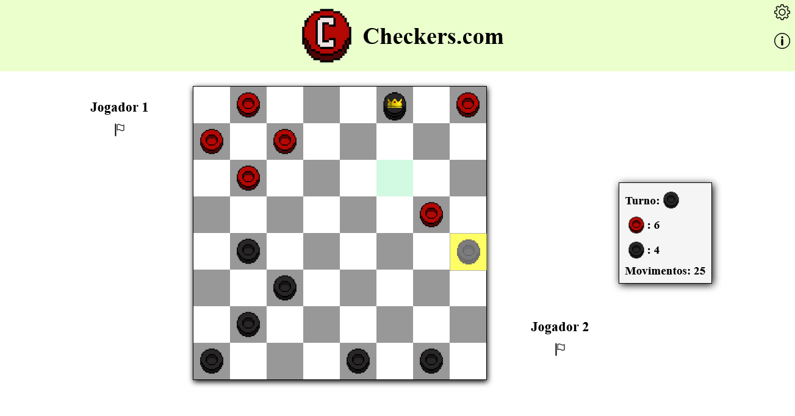
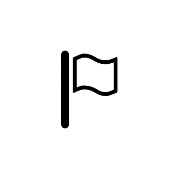
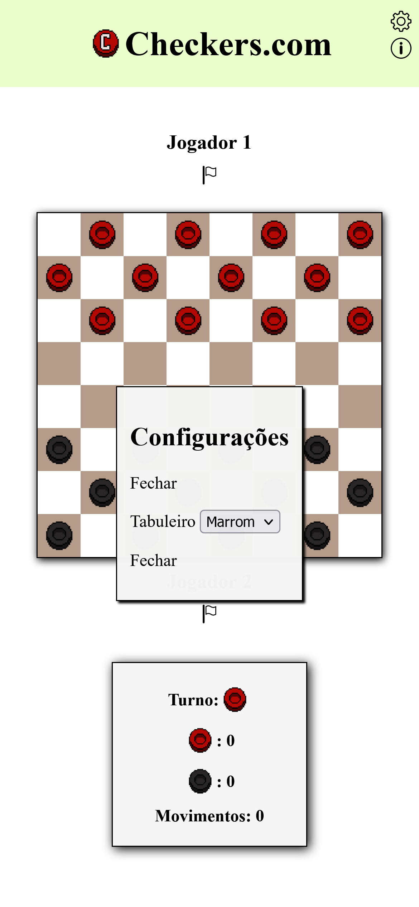
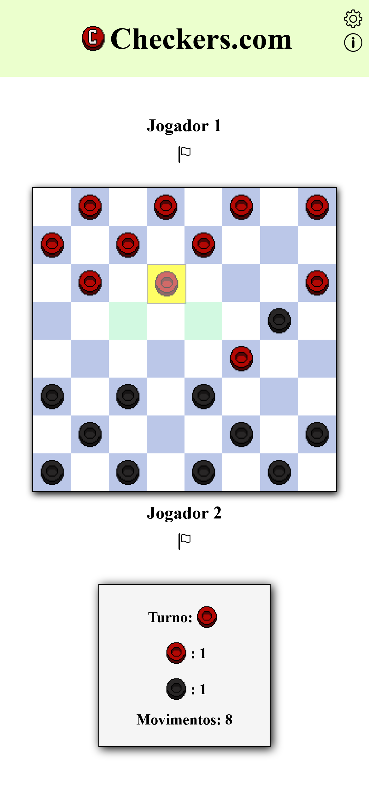
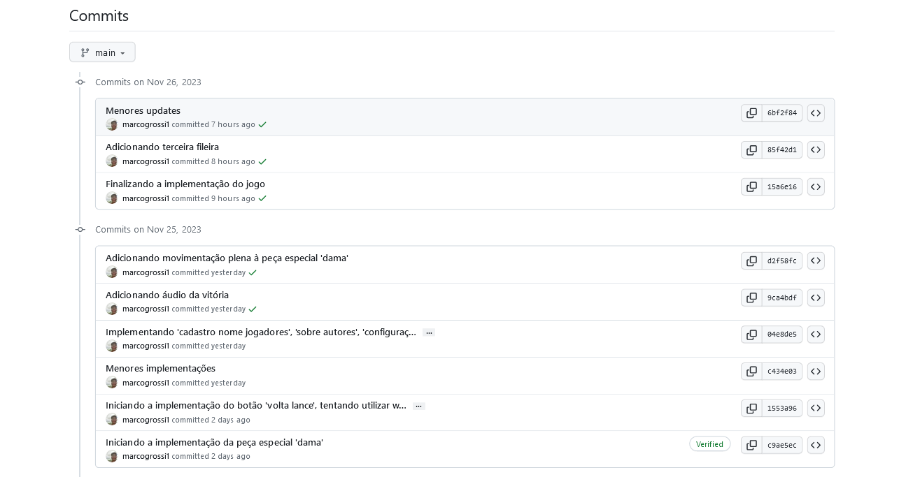

# Checkers.com



## Modo de jogo

* Tabuleiro 8x8, com 12 peças;
* Chegando ao lado oposto, a peça se torna uma 'dama';
    - A dama pode se mover uma peça por vez para todas as direções.
* A captura **não** é obrigatória;
* O jogo acaba quando todas as peças de um dos jogadores for capturada ou se o jogador 'abandonar';

## Implementações

* Uso de _webStorage_ para armazenar o nome dos jogadores;
* Distribuição das peças dinamicamente (via JavaScript);
* Painel de informações com 'Turno', 'Quantidade de peças capturadas' e 'Movimentos';
* Botão 'abandonar', que termina o jogo;
    - 'Abandonar' só pode ser ativado no turno do jogador;
    
* Janela 'sobre', que traz informações sobre os autores;
* Janela 'configurações', que permite mudar a cor do tabuleiro;
    - Implementado com o uso do elemento 'selection' (poderia ser utilizado 'color').
    
* Highlights das jogadas possíveis para todas as peças;
* Tamanho do tabuleiro e quantidade de peças dinâmicos.

### Implementações Extras

1. Usar flexbox e grid para o layout
    - Toda o layout da página foi feita utilizando flexbox;
    - O tabuleiro foi criado usando grid:
    ```
        #tabuleiro {
            width: 400px;
            height: 400px;
            margin: 20px;
            border: 1px solid black;
            box-shadow: 1px 2px 7px black;

            display: grid;
            grid-template-columns: repeat(8, 50px);
            grid-template-rows: repeat(8,50px);
        }
    ```

2. Usar media queries (CSS) para tornar as páginas "responsivas" (adaptáveis a diferentes telas - todas as páginas têm que ficar boas em telas grandes, médias e pequenas - pelo menos 320px de largura)
    - A página possui _media queries_ que permitem com que ela seja vista perfeitamente em telefones (no mínimo 350px) e tablets (até 850px).
    

9. Usar o Git com o Github (ou outro serviço de hospedagem de repositórios) fazendo vários commits (por todos alunos pelo menos 1 por semana)
    - Durante toda a execução do projeto, foi utilizado a combinação Git-Github para manter um backup e registrar mudanças na página.
    